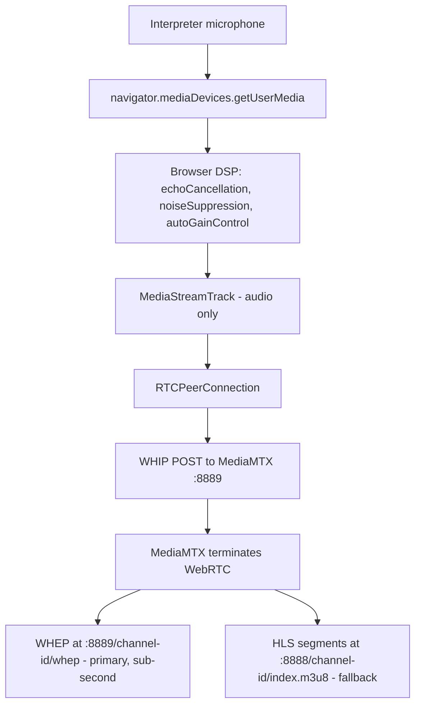
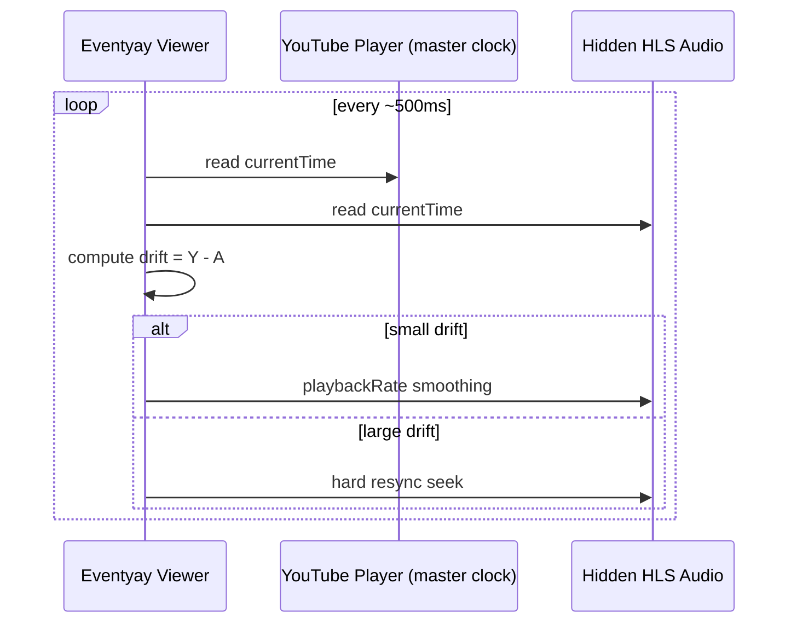
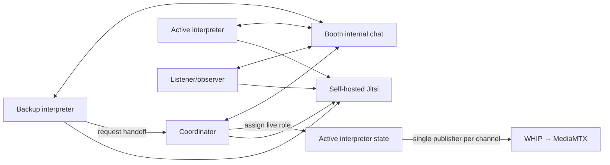
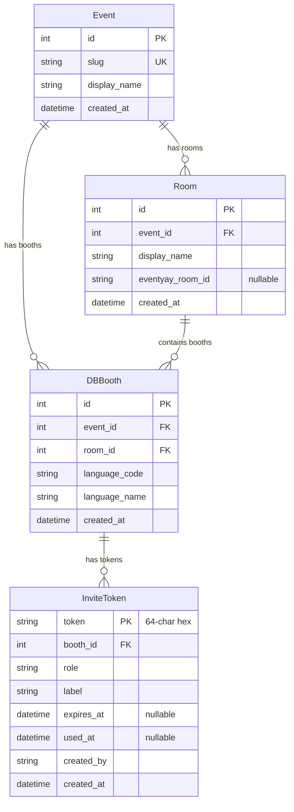
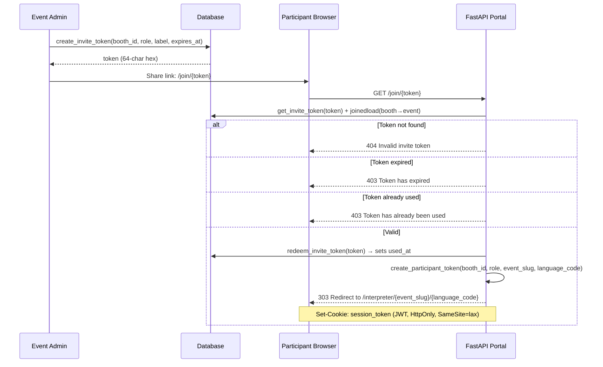

# Eventyay Interpretation Portal Architecture

## 1. Scope and intent

The interpreter portal is a collaborative interpretation booth console integrated with Eventyay live workflows.

It covers:

- interpreter monitoring (self-hosted Jitsi Meet)
- interpreter audio ingest (WebRTC/WHIP → MediaMTX → WHEP/HLS)
- booth operations (participants, roles, handoff, internal chat, health state)

It does **not** replace Eventyay viewer playback surfaces; it feeds them.

## 2. Full system architecture

```mermaid
flowchart LR
  Speaker[Speaker/Presenter] -->|AV + floor audio| Jitsi[Self-hosted Jitsi Meet]
  Interpreter[Interpreter Portal] -->|Jitsi iframe monitor| Jitsi
  Interpreter -->|Mic → WHIP POST| MediaMTX[MediaMTX :8889]
  MediaMTX -->|WHEP WebRTC| WHEPListener[/listener-webrtc page - primary]
  MediaMTX -->|HLS segments| HLS[MediaMTX :8888]
  HLS -->|index.m3u8| HLSListener[/listen page - hls.js fallback]
  HLS -->|index.m3u8| Viewer[Eventyay stage page]
  Viewer -->|sync loop| YouTube[YouTube player - master clock]
```

**Key principle:** Python is never in the audio path. The browser publishes directly to MediaMTX via WHIP. MediaMTX handles WebRTC termination and serves listeners via WHEP (sub-second latency) or HLS (fallback, ~2–3 s latency).

## 3. Interpreter audio pipeline



No server-side audio processing. MediaMTX does everything.

### Seamless interpreter handoff

MediaMTX runs with `overridePublisher: yes`. Paths are created with `alwaysAvailable: true` via the MediaMTX Control API (:9997) so readers stay connected even when no publisher is active. When a coordinator switches the active interpreter:

1. The incoming interpreter's WHIP POST succeeds immediately (MediaMTX kicks the outgoing publisher)
2. WHEP listeners receive the new publisher's audio within ~1.5–3 s (the `RTCPeerConnection` stays open; MediaMTX routes the new track automatically)
3. HLS fallback listeners experience a longer gap (~10–15 s) as hls.js recovers from the muxer reset

## 4. Viewer synchronization flow



## 5. Multi-user booth architecture



## 6. Booth identity scheme

A booth is identified by three coordinates:

| Coordinate      | Format                          | Example         |
|-----------------|---------------------------------|-----------------|
| `event_slug`    | Lowercase alphanumeric + hyphens, no consecutive hyphens, max 64 chars | `pycon2026` |
| `language_code` | ISO 639-1 two-letter code       | `en`            |
| `instance`      | `primary` or `backup`           | `primary`       |

**Booth ID:** `{event_slug}-{language_code}` → `pycon2026-en`

**MediaMTX path:** `{event_slug}/{language_code}` → `pycon2026/en` (one active stream per language per event)

**Channel ID:** defaults to the MediaMTX path (`{event_slug}/{language_code}`) when created via `create_booth()`. Can be overridden with an explicit value.

**Room ID:** optional integer FK to an Eventyay Room (`room_id: int | None`). Nullable — has no effect on booth identity. Exists to support future Eventyay integration for mapping booths to event rooms.

### Validation rules

- **Event slug:** `^[a-z0-9]+(?:-[a-z0-9]+)*$`, 1–64 characters. Must start and end with alphanumeric. No consecutive hyphens, no underscores, no spaces.
- **Language code:** Exactly two lowercase ASCII letters matching a recognised ISO 639-1 code.
- **Instance:** Either `primary` or `backup`. Only one instance publishes at a time.

### Bidirectional conversion

```
booth_id_to_mediamtx_path("pycon2026-en")  →  "pycon2026/en"
mediamtx_path_to_booth_id("pycon2026/en")  →  "pycon2026-en"
parse_booth_id("my-great-event-fr")        →  ("my-great-event", "fr")
```

The language code is always the last two characters after the final hyphen.

### Legacy compatibility

Existing free-form booth IDs (e.g. `hall-a-fr`) that happen to end with a valid ISO 639-1 code are parsed automatically. IDs that cannot be parsed are accepted with empty identity fields during the migration window.

## 7. Runtime components in this repository

- `fastapi_app.py`
  - FastAPI routes (legacy + event-scoped), WebSocket event handlers with cross-event validation, `_resolve_whip_url` shared helper, JWT auth, Jinja2 templates, health checks
- `portal/booth_identity.py`
  - booth identity scheme: validation (event slug, ISO 639-1 language code, instance), booth ID generation, MediaMTX path mapping, bidirectional conversion
- `portal/booth_state.py`
  - async in-memory booth registry, participant role policy, active interpreter ownership, handoff state, chat history, event-scoped queries (`get_booth`, `get_booth_for_event`, `validate_booth_event`)
- `portal/auth.py`
  - JWT token creation and validation (PyJWT), participant token issuance with role claims
- `portal/config.py`
  - pydantic-settings configuration loaded from environment variables / `.env`
- `portal/roles.py`
  - Permission enum, role-permission mapping, standalone permission helpers (mirrors Eventyay `core/permissions.py`)
- `portal/models.py`
  - SQLAlchemy 2.0 declarative models: Event, Room, DBBooth, InviteToken
- `portal/database.py`
  - async engine lifecycle, session factory, CRUD helpers for all models
- `alembic/`
  - database migration framework (async-aware env.py, version-controlled migration scripts)
- `templates/base.html`
  - Eventyay-style header and page shell
- `templates/interpreter_booth.html`
  - server-rendered interpreter booth page
- `templates/listener.html`
  - attendee HLS listener page with hls.js auto-recovery (fallback)
- `templates/listener-webrtc.html`
  - attendee WHEP WebRTC listener page (primary, sub-second latency)
- `static/js/interpreter-booth.js`
  - browser mic capture, WHIP WebRTC publishing, Jitsi iframe embed, WebSocket coordination, DOM updates
- `static/js/whep-listener.js`
  - WHEP WebRTC listener client — connects to MediaMTX WHEP endpoint for low-latency playback
- `static/css/interpreter.css`
  - lightweight Eventyay-aligned styles
- `mediamtx.yml`
  - MediaMTX configuration (WHIP ingest, WHEP playback, HLS fallback, Control API, overridePublisher for handoff)
- `docker-compose.yml`
  - all services: portal, mediamtx, jitsi-web, jitsi-prosody, jitsi-jicofo, jitsi-jvb

## 7.1 Database layer

### Stack

```
FastAPI routes
  ↓
portal/database.py  (async CRUD helpers)
  ↓
SQLAlchemy 2.0  (async ORM, declarative models)
  ↓
Alembic  (migration framework)
  ↓
SQLite + aiosqlite (development)  /  PostgreSQL + asyncpg (production)
```

### Two data stores, one purpose each

| Store | Manages | Lifetime | Technology |
|-------|---------|----------|------------|
| **In-memory registry** (`booth_state.py`) | Runtime booth state: participants, active interpreter, handoff, chat | Process lifetime (lost on restart) | Python dataclasses + `asyncio.Lock` |
| **Persistent database** (`models.py`) | Admin-managed entities: events, rooms, booths, invite tokens | Survives restarts | SQLAlchemy + Alembic |

The in-memory registry handles real-time coordination (WebSocket state, sub-second updates).
The persistent database stores configuration that must survive restarts (which events exist, which booths are configured, invite tokens).

### Models



### Key design decisions

- **No `mediamtx_path` column.** Derived at runtime via `make_mediamtx_path(event.slug, language_code)`. Single source of truth in `portal/booth_identity.py`.
- **No `hls_url` column.** WHEP is the primary playback protocol. HLS URLs are derived from the MediaMTX path when needed.
- **Model name `DBBooth`** avoids collision with the in-memory `Booth` dataclass in `booth_state.py`.
- **Database-agnostic models.** SQLAlchemy column types work on both SQLite and PostgreSQL. Switching databases requires only changing `DATABASE_URL`.
- **Async engine.** Uses `create_async_engine` with `aiosqlite` (dev) or `asyncpg` (prod) — non-blocking I/O consistent with FastAPI's async architecture.

### Database lifecycle in Docker

```
docker compose up
  ↓
portal container starts
  ↓
alembic upgrade head  (applies any pending migrations)
  ↓
uvicorn starts serving
  ↓
SQLite file lives on 'portal-data' Docker volume

docker compose down    →  containers removed, volume preserved
docker compose up      →  data still there (volume survives)
docker volume rm ...   →  data gone (explicit action required)
```

### Migration workflow

```
1. Edit portal/models.py  (add/change columns, tables)
2. alembic revision --autogenerate -m "describe the change"
3. Review the generated migration in alembic/versions/
4. alembic upgrade head  (apply locally)
5. Commit the migration file (alembic/versions/*.py)
6. Never commit .db files
```

### Environment configuration

| Environment | DATABASE_URL | Notes |
|-------------|-------------|-------|
| Native dev | `sqlite+aiosqlite:///./interpretation.db` | SQLite file in project root |
| Docker dev | `sqlite+aiosqlite:////data/interpretation.db` | SQLite on `portal-data` volume |
| CI | `sqlite+aiosqlite://` | In-memory, no file created |
| Production | `postgresql+asyncpg://user:pass@db:5432/interpretation` | PostgreSQL with asyncpg driver |

The `DATABASE_URL` env var overrides the default. Alembic reads the same setting.

## 8. State model and ownership

`BoothRegistry` tracks:

- booth identity (`booth_id`, `event_slug`, `language_code`, `instance`, `mediamtx_path`)
- booth metadata (`language`, `channel_id`, `room_id`)
- active interpreter id
- participant roster and roles
- per-participant connection, mic, and ingest state
- handoff state (`idle`, `active`)
- internal booth chat timeline (last 500 messages)
- ingest status

The browser keeps only local UI/session state: joined participant id, mic stream, peer connection, current booth snapshot, and current chat messages. Server state remains the source of truth for who is active.

## 9. Active interpreter enforcement — three-layer model

Three independent layers prevent unauthorized audio publishing. Each layer is tested independently so a failure in one layer does not compromise the others.

### Layer 1 — Application state (booth_state.py)

`BoothRegistry.update_participant_state()` rejects any attempt to set `mic_active=True` or `ingest_connected=True` unless:

1. The participant's role is `interpreter` (coordinators and listeners are rejected).
2. The participant is the booth's current `active_interpreter_id`.

`BoothRegistry.check_publish_permission()` encapsulates the same two checks for reuse by Layer 2.

Enforcement rules:

1. Start WHIP ingest only when local participant is active for the channel.
2. Only the active interpreter can click "Go Live" to publish audio.
3. Active interpreter handoff via `booth:set-active` clears the previous publisher's mic and ingest state.
5. Coordinator role can override active ownership (but cannot publish).
6. Non-interpreter roles cannot become active publishers.

### Layer 2 — WHIP URL gating (fastapi_app.py)

`GET /api/booth/{booth_id}/whip-url?participant_id=...` returns the MediaMTX WHIP ingest URL **only** to the active interpreter. Non-active interpreters and non-interpreter roles receive HTTP 403 and never learn the URL. The browser must call this endpoint before starting a WHIP session.

### Layer 3 — Media server enforcement (mediamtx.yml)

MediaMTX runs with `overridePublisher: yes` on all paths. If a rogue or stale WHIP session bypasses Layers 1 and 2, MediaMTX itself ensures only one publisher is live per path at any time — the old publisher is disconnected immediately when a new one arrives.

```
Layer 1: booth_state  →  role + active-interpreter check  (PermissionError)
Layer 2: /whip-url    →  gated WHIP URL endpoint          (HTTP 403)
Layer 3: MediaMTX     →  overridePublisher: yes            (old publisher kicked)
```

## 9.1 Multi-event namespace isolation

Event-scoped API endpoints (`/api/events/{event_slug}/booths/...`) enforce strict
namespace isolation:

- `list_booths_for_event(event_slug)` filters the in-memory registry by event_slug.
- `get_booth_for_event(event_slug, language_code)` returns `None` (not a new booth) if the combination doesn't exist.
- `validate_booth_event(booth_id, expected_event)` raises `PermissionError` if the booth's parsed event_slug doesn't match — used by event-scoped WHIP URL endpoint and WebSocket join handler.
- MediaMTX paths embed the event slug (`{event_slug}/{language_code}`), so audio streams are physically separated per event.
- WebSocket join with a mismatched `event_slug` field is rejected before the participant is added to the booth.

## 9.2 Invite-token authentication flow

Invite tokens provide a single-use, shareable URL for joining a specific booth with a pre-assigned role.

### Flow



### JWT cookie claims

| Claim | Type | Description |
|-------|------|-------------|
| `sub` | UUID string | Unique participant identifier (generated per redemption) |
| `booth_id` | int | Database ID of the assigned booth |
| `role` | string | One of: `interpreter`, `coordinator`, `listener`, `event_admin`, `super_admin` |
| `event_slug` | string | Slug of the event the booth belongs to |
| `language_code` | string | ISO 639-1 language code of the booth |
| `iat` | int | Issued-at timestamp |
| `exp` | int | Expiry timestamp (configurable via `JWT_EXPIRY_SECONDS`) |

### Security properties

- Tokens are 64-character cryptographically random hex strings (`secrets.token_hex(32)`).
- Each token can only be used once (`used_at` is set on redemption).
- Optional expiry (`expires_at`) allows time-limited invitations.
- The JWT cookie is `HttpOnly` and `SameSite=lax` to prevent XSS and CSRF.
- Token lookup uses `joinedload` to eagerly load booth and event data in a single query.

## 10. Reconnect and teardown behavior

Reconnect:

- browser peer connection state is surfaced as connected/reconnecting/disconnected
- stale live publishers are stopped when active ownership changes
- hls.js listener auto-recovers from HLS muxer reset during handoff (fallback path)
- WHEP listeners stay connected during handoff via `alwaysAvailable` paths; new audio arrives within ~1.5–3 s

Teardown:

- close WebRTC peer connection (stops WHIP session in MediaMTX)
- update booth state over WebSocket
- remove participant from in-memory booth on WebSocket disconnect

## 11. Jitsi role vs ingest role

Jitsi responsibilities:

- monitor floor audio/video (receive-only)
- booth coordination context (interpreters hear the speaker)
- self-hosted via Docker (jitsi-web, jitsi-prosody, jitsi-jicofo, jitsi-jvb)

Jitsi non-goals:

- not the interpreter ingest transport
- not viewer delivery pipeline

Ingest responsibilities:

- receive interpreter mic audio uplink via WHIP → MediaMTX
- MediaMTX produces WHEP for low-latency WebRTC playback and HLS as fallback for viewer consumption

## 12. Deployment assumptions

- interpreter portal is served as an ASGI application (FastAPI + uvicorn)
- WHIP endpoint (MediaMTX) is reachable from interpreter browsers
- WHEP endpoint (MediaMTX) is reachable from listener browsers
- WebSocket is available for cross-client booth state
- self-hosted Jitsi Meet provides floor monitoring (4 Docker containers)
- viewer stage page consumes language channels from MediaMTX (WHEP or HLS)
- PostgreSQL and Redis can be added later for multi-worker scale; SQLAlchemy + Alembic are already in place for persistent storage
- in Docker, `portal-data` volume persists the SQLite database across container restarts
- in Docker, `DOCKER_HOST_ADDRESS` must be set to the host's LAN IP for JVB ICE to work

## 13. Reliability and operational constraints

- recommend headphones-first operation to reduce feedback risk
- prevent local audio loopback in mic capture path
- preserve clear state indicators for ingest, reconnecting, and live ownership
- keep service boundaries explicit: FastAPI = coordination only, MediaMTX = audio pipeline, Jitsi = floor monitoring
