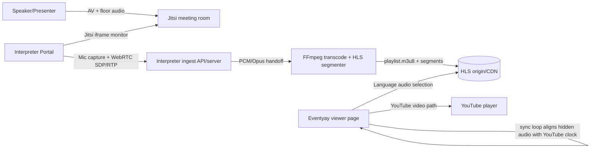
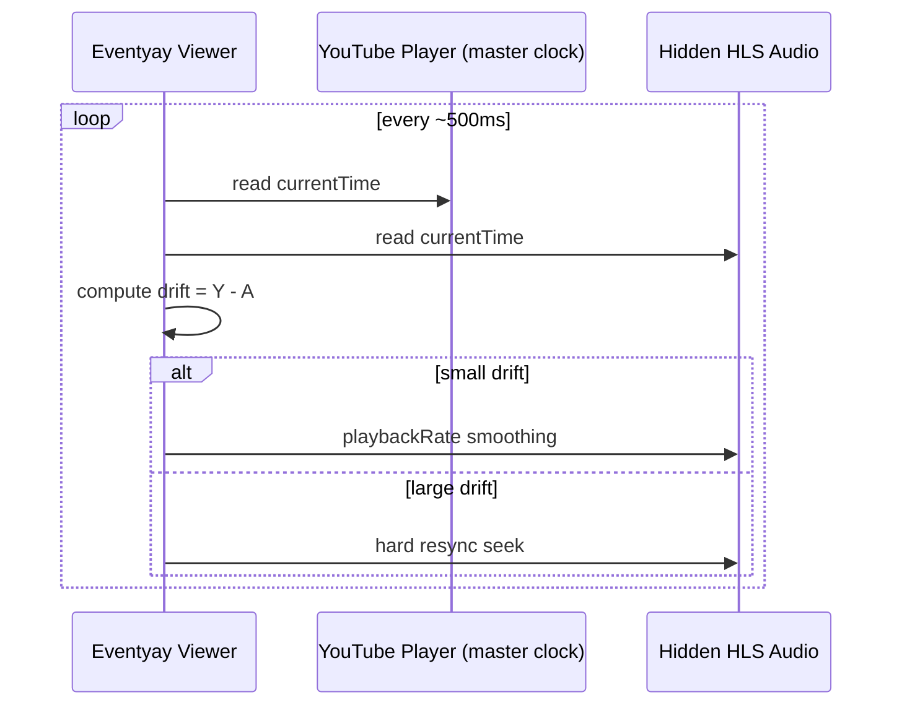
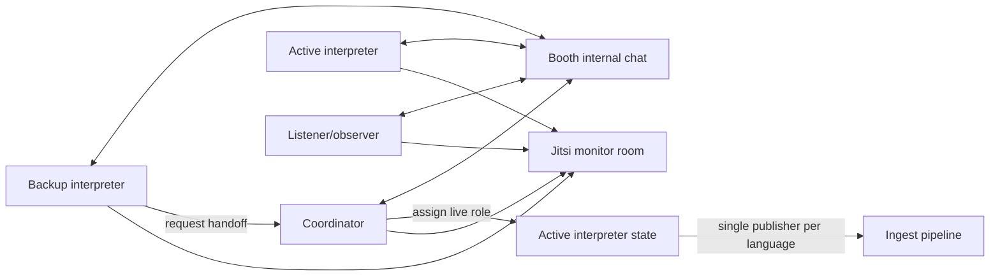

# Eventyay Interpretation Portal Architecture

## 1. Scope and intent

The interpreter portal is a collaborative interpretation booth console integrated with Eventyay live workflows.

It covers:

- interpreter monitoring (Jitsi)
- interpreter ingest (WebRTC audio uplink)
- booth operations (participants, handoff, internal chat, health state)

It does **not** replace Eventyay viewer playback surfaces; it feeds them.

## 2. Full system architecture



## 3. Interpreter audio pipeline

```mermaid
flowchart TD
  Mic[Interpreter microphone] --> GUM[navigator.mediaDevices.getUserMedia]
  GUM --> DSP[Browser DSP\n echoCancellation/noiseSuppression/autoGainControl]
  DSP --> Track[MediaStreamTrack audio]
  Track --> PC[RTCPeerConnection]
  PC --> Offer[Create SDP offer]
  Offer --> API[POST /api/interpreter/connect/{channel}]
  API --> Answer[SDP answer]
  Answer --> PC
  PC --> RTP[Opus over RTP]
  RTP --> Ingest[Ingest termination]
  Ingest --> FFmpeg[FFmpeg encode/segment]
  FFmpeg --> HLS[HLS output]
```

## 4. Viewer synchronization flow



## 5. Multi-user booth architecture



## 6. Runtime components in this repository

- `app.py`
  - Flask routes, Socket.IO event handlers, access token checks, and ingest API boundaries
- `portal/booth_state.py`
  - in-memory booth registry, participant role policy, active interpreter ownership, handoff state, and chat history
- `portal/ingest.py`
  - aiortc peer connection handling and FFmpeg/HLS recorder setup
- `templates/base.html`
  - Eventyay-style header and page shell
- `templates/interpreter_booth.html`
  - server-rendered booth page
- `static/js/interpreter-booth.js`
  - browser mic capture, WebRTC offer creation, Jitsi iframe setup, Socket.IO client behavior, and DOM updates
- `static/css/interpreter.css`
  - lightweight Eventyay-aligned styles

## 7. State model and ownership

`BoothRegistry` tracks:

- booth metadata (`booth_id`, `language`, `channel_id`)
- active interpreter id
- participant roster and roles
- per-participant connection, mic, and ingest state
- handoff state
- internal booth chat timeline
- ingest status

The browser keeps only local UI/session state: joined participant id, mic stream, peer connection, current booth snapshot, and current chat messages. Server state remains the source of truth for who is active.

## 8. Active interpreter enforcement

Enforcement rules:

1. Start ingest only when local participant is active for the channel.
2. The server rejects ingest negotiation from standby interpreters.
3. Active interpreter handoff clears the previous publisher's mic and ingest state.
4. The server disconnects the previous ingest session when active ownership changes.
5. Coordinator role can override active ownership.
6. Non-interpreter roles cannot become active publishers.

## 9. Reconnect and teardown behavior

Reconnect:

- browser peer connection state is surfaced as connected/reconnecting/disconnected
- stale live publishers are stopped when active ownership changes
- durable reconnect policy belongs in the ingest service layer once production persistence is added

Teardown:

- close peer connection
- stop recorder and peer connection server-side on disconnect
- update booth state over Socket.IO
- remove participant from in-memory booth on socket disconnect

## 10. Jitsi role vs ingest role

Jitsi responsibilities:

- monitor floor audio/video
- booth coordination context

Jitsi non-goals:

- not the interpreter ingest transport
- not viewer delivery pipeline

Ingest responsibilities:

- receive interpreter mic audio uplink via WebRTC
- hand off to FFmpeg/HLS chain for viewer consumption

## 11. Deployment assumptions

- interpreter portal is served as a web module in Eventyay deployment topology
- ingest endpoint is reachable from interpreter browsers
- Socket.IO is available for cross-client booth state
- local development uses locked PyAV wheels instead of compiling against system FFmpeg headers
- aiortc `MediaRecorder` provides the HLS output path used by the prototype
- viewer stage page consumes generated HLS language channels
- PostgreSQL and Redis can be added later for persistence and multi-worker scale

## 12. Reliability and operational constraints

- recommend headphones-first operation to reduce feedback risk
- prevent local audio loopback in mic capture path
- preserve clear state indicators for ingest, reconnecting, and live ownership
- keep service boundaries explicit for aiortc/Janus backend compatibility
