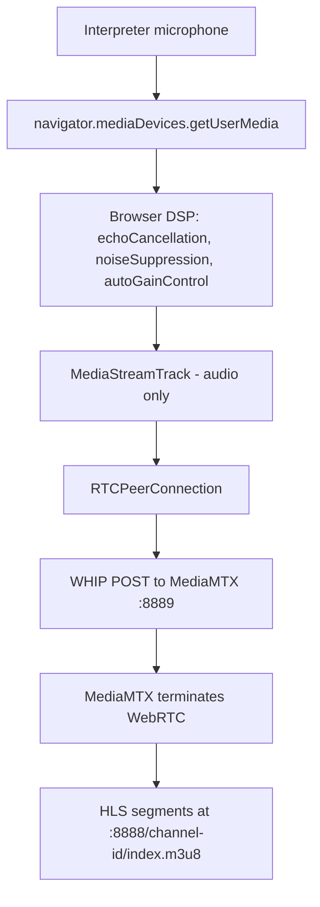
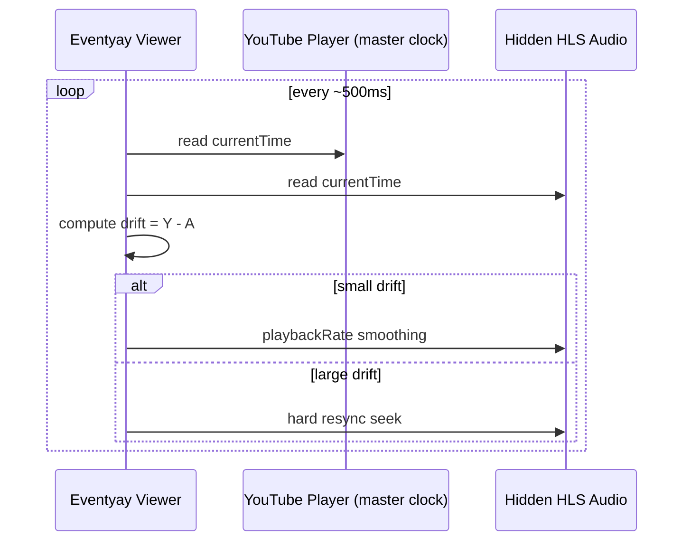
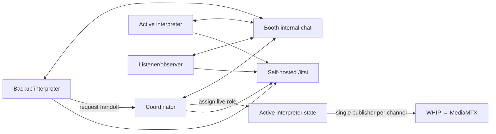

# Eventyay Interpretation Portal Architecture

## 1. Scope and intent

The interpreter portal is a collaborative interpretation booth console integrated with Eventyay live workflows.

It covers:

- interpreter monitoring (self-hosted Jitsi Meet)
- interpreter audio ingest (WebRTC/WHIP → MediaMTX → HLS)
- booth operations (participants, roles, handoff, internal chat, health state)

It does **not** replace Eventyay viewer playback surfaces; it feeds them.

## 2. Full system architecture

```mermaid
flowchart LR
  Speaker[Speaker/Presenter] -->|AV + floor audio| Jitsi[Self-hosted Jitsi Meet]
  Interpreter[Interpreter Portal] -->|Jitsi iframe monitor| Jitsi
  Interpreter -->|Mic → WHIP POST| MediaMTX[MediaMTX :8889]
  MediaMTX -->|HLS segments| HLS[MediaMTX :8888]
  HLS -->|index.m3u8| Listener[/listen page - hls.js]
  HLS -->|index.m3u8| Viewer[Eventyay stage page]
  Viewer -->|sync loop| YouTube[YouTube player - master clock]
```

**Key principle:** Python is never in the audio path. The browser publishes directly to MediaMTX via WHIP. MediaMTX handles WebRTC termination, transcoding, and HLS segmentation.

## 3. Interpreter audio pipeline



No server-side audio processing. MediaMTX does everything.

### Seamless interpreter handoff

MediaMTX runs with `overridePublisher: yes`. When a coordinator switches the active interpreter:

1. The incoming interpreter's WHIP POST succeeds immediately (MediaMTX kicks the outgoing publisher)
2. MediaMTX briefly destroys and recreates the HLS muxer (~200ms gap)
3. The `/listen/{booth_id}` page uses hls.js with auto-recovery: on fatal errors, it destroys the player, waits briefly, and recreates — the listener hears a ~2s gap, no page reload needed

## 4. Viewer synchronization flow



## 5. Multi-user booth architecture



## 6. Runtime components in this repository

- `fastapi_app.py`
  - FastAPI routes, WebSocket event handlers, JWT auth, Jinja2 templates, health checks
- `portal/booth_state.py`
  - async in-memory booth registry, participant role policy, active interpreter ownership, handoff state, chat history
- `portal/auth.py`
  - JWT token creation and validation (PyJWT)
- `portal/config.py`
  - pydantic-settings configuration loaded from environment variables / `.env`
- `templates/base.html`
  - Eventyay-style header and page shell
- `templates/interpreter_booth.html`
  - server-rendered interpreter booth page
- `templates/listener.html`
  - attendee HLS listener page with hls.js auto-recovery
- `static/js/interpreter-booth.js`
  - browser mic capture, WHIP WebRTC publishing, Jitsi iframe embed, WebSocket coordination, DOM updates
- `static/css/interpreter.css`
  - lightweight Eventyay-aligned styles
- `mediamtx.yml`
  - MediaMTX configuration (WHIP ingest, HLS output, overridePublisher for handoff)
- `docker-compose.yml`
  - all services: portal, mediamtx, jitsi-web, jitsi-prosody, jitsi-jicofo, jitsi-jvb

## 7. State model and ownership

`BoothRegistry` tracks:

- booth metadata (`booth_id`, `language`, `channel_id`)
- active interpreter id
- participant roster and roles
- per-participant connection, mic, and ingest state
- handoff state (`idle`, `active`)
- internal booth chat timeline (last 500 messages)
- ingest status

The browser keeps only local UI/session state: joined participant id, mic stream, peer connection, current booth snapshot, and current chat messages. Server state remains the source of truth for who is active.

## 8. Active interpreter enforcement

Enforcement rules:

1. Start WHIP ingest only when local participant is active for the channel.
2. Only the active interpreter can click "Go Live" to publish audio.
3. Active interpreter handoff via `booth:set-active` clears the previous publisher's mic and ingest state.
4. MediaMTX enforces single-publisher per path (`overridePublisher: yes`).
5. Coordinator role can override active ownership.
6. Non-interpreter roles cannot become active publishers.

## 9. Reconnect and teardown behavior

Reconnect:

- browser peer connection state is surfaced as connected/reconnecting/disconnected
- stale live publishers are stopped when active ownership changes
- hls.js listener auto-recovers from HLS muxer reset during handoff

Teardown:

- close WebRTC peer connection (stops WHIP session in MediaMTX)
- update booth state over WebSocket
- remove participant from in-memory booth on WebSocket disconnect

## 10. Jitsi role vs ingest role

Jitsi responsibilities:

- monitor floor audio/video (receive-only)
- booth coordination context (interpreters hear the speaker)
- self-hosted via Docker (jitsi-web, jitsi-prosody, jitsi-jicofo, jitsi-jvb)

Jitsi non-goals:

- not the interpreter ingest transport
- not viewer delivery pipeline

Ingest responsibilities:

- receive interpreter mic audio uplink via WHIP → MediaMTX
- MediaMTX produces HLS for viewer consumption

## 11. Deployment assumptions

- interpreter portal is served as an ASGI application (FastAPI + uvicorn)
- WHIP endpoint (MediaMTX) is reachable from interpreter browsers
- WebSocket is available for cross-client booth state
- self-hosted Jitsi Meet provides floor monitoring (4 Docker containers)
- viewer stage page consumes HLS language channels from MediaMTX
- PostgreSQL and Redis can be added later for persistence and multi-worker scale
- in Docker, `DOCKER_HOST_ADDRESS` must be set to the host's LAN IP for JVB ICE to work

## 12. Reliability and operational constraints

- recommend headphones-first operation to reduce feedback risk
- prevent local audio loopback in mic capture path
- preserve clear state indicators for ingest, reconnecting, and live ownership
- keep service boundaries explicit: FastAPI = coordination only, MediaMTX = audio pipeline, Jitsi = floor monitoring
