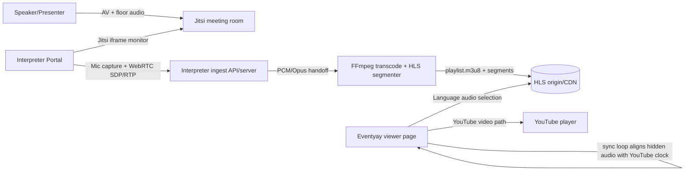
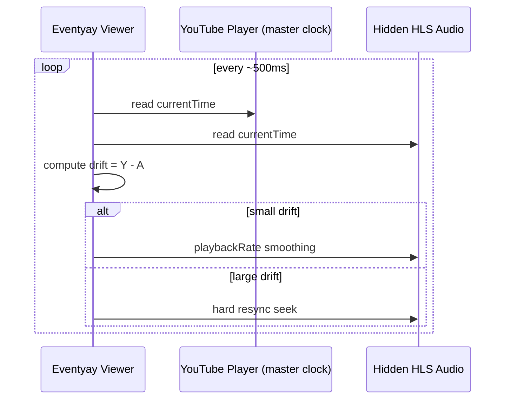
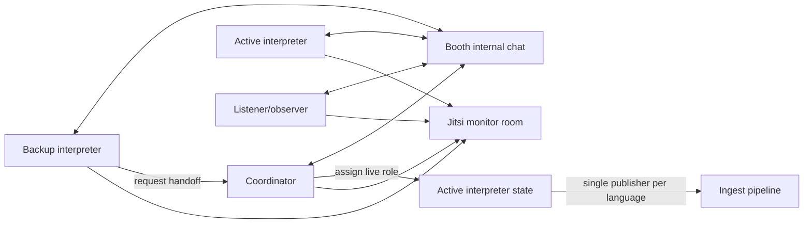

# Eventyay Interpretation Portal Architecture

## 1. Scope and intent

The interpreter portal is a collaborative interpretation booth console integrated with Eventyay live workflows.

It covers:

- interpreter monitoring (Jitsi)
- interpreter ingest (WebRTC audio uplink)
- booth operations (participants, handoff, internal chat, health state)

It does **not** replace Eventyay viewer playback surfaces; it feeds them.

## 2. Full system architecture



## 3. Interpreter audio pipeline

```mermaid
flowchart TD
  Mic[Interpreter microphone] --> GUM[navigator.mediaDevices.getUserMedia]
  GUM --> DSP[Browser DSP\n echoCancellation/noiseSuppression/autoGainControl]
  DSP --> Track[MediaStreamTrack audio]
  Track --> PC[RTCPeerConnection]
  PC --> Offer[Create SDP offer]
  Offer --> API[POST /api/interpreter/connect/{channel}]
  API --> Answer[SDP answer]
  Answer --> PC
  PC --> RTP[Opus over RTP]
  RTP --> Ingest[Ingest termination]
  Ingest --> FFmpeg[FFmpeg encode/segment]
  FFmpeg --> HLS[HLS output]
```

## 4. Viewer synchronization flow



## 5. Multi-user booth architecture



## 6. Runtime components in this repository

- `src/views/InterpreterConsoleView.vue`
  - primary layout and orchestration surface
- `src/composables/useInterpreterBooth.js`
  - booth state, ingest lifecycle, handoff enforcement, reconnect behavior
- `src/services/jitsiEmbed.js`
  - Jitsi URL parsing and receive-first embed options
- `src/services/ingestClient.js`
  - ingest endpoint abstraction
- `src/services/micStreamingManager.js`
  - microphone stream, level meter, peer connection, stats, teardown
- `src/services/boothRealtime.js`
  - local + optional websocket booth sync transport

## 7. State model and ownership

`useInterpreterBooth()` tracks:

- session metadata (`eventSlug`, `boothId`, `language`, `channelId`)
- jitsi panel state
- mic capture and device state
- ingest transport state
- pre-flight checklist state
- participant roster and active interpreter
- booth chat timeline

## 8. Active interpreter enforcement

Enforcement rules:

1. Start ingest only when local participant is active for the channel.
2. On active participant reassignment, local live publisher is stopped.
3. Coordinator role can override active ownership.
4. Non-interpreter roles do not receive live-toggle actions.

## 9. Reconnect and teardown behavior

Reconnect:

- bounded exponential backoff for ingest reconnect attempts
- status transitions: `connecting -> connected -> reconnecting/failed`

Teardown:

- close peer connection
- clear interval/animation-frame timers
- stop media tracks
- close realtime transport channels
- reset initialized state

## 10. Jitsi role vs ingest role

Jitsi responsibilities:

- monitor floor audio/video
- booth coordination context

Jitsi non-goals:

- not the interpreter ingest transport
- not viewer delivery pipeline

Ingest responsibilities:

- receive interpreter mic audio uplink via WebRTC
- hand off to FFmpeg/HLS chain for viewer consumption

## 11. Deployment assumptions

- interpreter portal is served as a web module in Eventyay deployment topology
- ingest endpoint is reachable from interpreter browsers
- optional websocket endpoint is available for cross-client booth state
- FFmpeg/HLS infrastructure is externally provisioned and monitored
- viewer stage page consumes generated HLS language channels

## 12. Reliability and operational constraints

- recommend headphones-first operation to reduce feedback risk
- prevent local audio loopback in mic capture path
- preserve clear state indicators for ingest, reconnecting, and live ownership
- keep service boundaries explicit for aiortc/Janus backend compatibility
